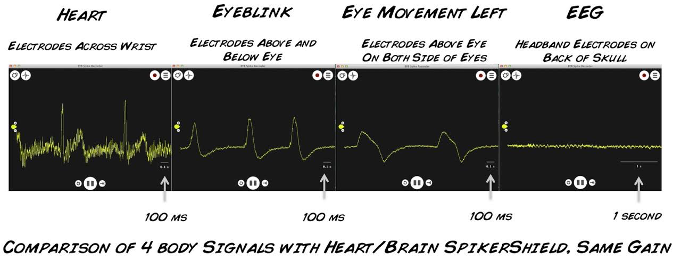
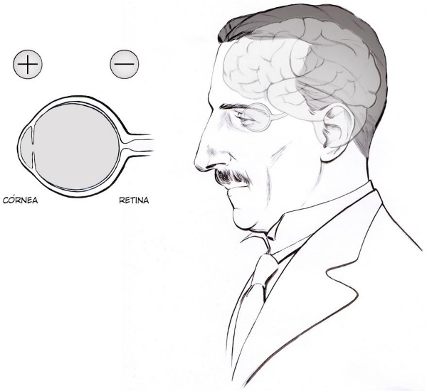
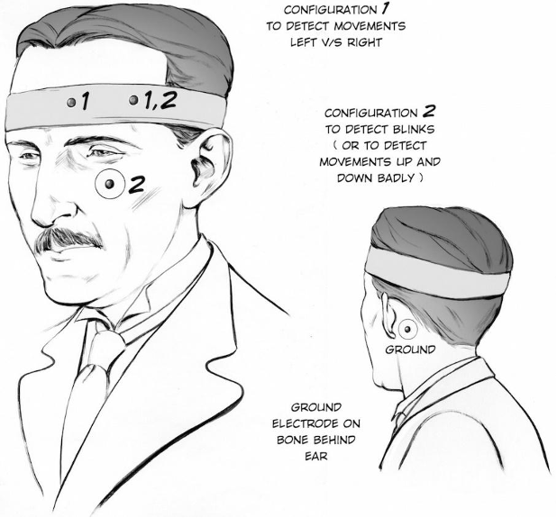

# Experiment: The Eyeball Dipole

Note that this experiment was adapted from material developed by [Backyard Brains](https://backyardbrains.com/experiments/eog).

## Background

I'll bet you knew that your heart and brain function using electrical forces.
But did you know that your eye has an electric potential?

The eye forms an _electric dipole_: the front of the eye (cornea) is the positive pole; the back of the eye is the negative pole (retina).
As you know, moving dipoles cause electric field changes that can be measured.

You can measure changes in electrical potentials in the body using electrodes.
There are a range of such measurements that are commonly made of:
* collections of neurons in the brain, using _electroencephalography_ (EEG) :brain:,
* the heart, using _electrocardiography_ (ECG) :heart:,
* muscles, using _electromyography_ (EMG) :muscle:; and
* the __eye__, using _electrooculography_ (EOG) :eye:.

All of these types of measurements are used for medical diagnosis.
For example, the EOG, which we'll be measuring today, is used for diagnosing eye problems (assessing the function of the pigment epithelium from changes in the eye's resting potential during adaptation from darkness to light).

_FYI_: Not all signals are equally easy to measure!
Check out the comparison diagram below.
You can see that the EOG is relatively straightforward to detect, but beware for our next EEG experiment!
We'll need to be much more careful about controlling sources of noise when trying to detect synchronized firing of neurons inside your brain.

## Using Electrodes to Detect Eye Movements

### Hypotheses

Take a look at this diagram of the eye dipole:

And then take a look at the two electrodes on your funky orange headband.

What position of electrodes would you need to detect a signal from moving the eye from left-to-right?
What sort of signal would you expect from this type of movement?

Repeat your reasoning for an up-and-down eye movement: how should you orient your electrodes relative to the eye movement?

### Experiment

Let's try to verify our reasoning by taking self-measurements using the _SpikerBox_!
You'll need to place the electrodes onto your head in a way that will best detect your moving eye dipole.

#### Tips for getting a good signal

___Clean skin___: Cleaning skin with alcohol wipes (to remove dirt or oil) before placing the electrodes can help improve the connection.

___Lubrication___: You will obtain a stronger signal if you apply electrode gel to improve the contact between the electrodes in the headband and your skin.
It can also help to clean the electrodes with alcohol wipes.
If you get a bad signal, you might like to add some gel to these metal contacts.

___Noise___: The _SpikerBox_ electrodes are very sensitive and can pick up changing electric fields from all sorts of sources.
You may play with some ways to reduce noise.
For example, try to keep your _SpikerBox_ away from electrical outlets, fluorescent lights, etc.
It may also help to run your laptop on battery power alone to avoid mains interference.

#### Attaching electrodes to your body

___Ground/reference___:
Add an electrode patch to the bony protrustion behind your ear (as below).
This will act as a ground potential.

___Connecting the electrodes___:
Position your headband with electrodes on either side of one of your eyes using Configuration 1 in the diagram above.
Place the red alligator clips on the electrodes in the headband, and the black alligator clip on the ground electrode, and connect the cable wires into the _SpikerBox_ using the orange connector.

### Obtaining a signal

Now you should be all connected up and ready to take some measurements of your own eye and test the hypotheses you made above!
Make sure your _SpikerBox_ is on and connected to your computer and your _BYB Spike Recorder_ is open and collecting data.

#### Left-Right Movement

See what happens when you move your eyes left and right.
With a swift motion of your eye ball, you should see a deflection in potential in one direction (e.g., +), followed by a rapid deflection in the opposite direction (-).

Do you see a signal of the opposite polarity when you move the eyeball in the opposite direction?

#### Up-Down Movement

_Note_: You will get a better signal if you use Configuration 2 in the diagram above, but you can explore to see what signal you get using Configuration 1.

Repeat the left-right experiment above.
Do down-to-up and up-to-down movements produce distinctive signals?

#### Eye Blinks

Try blinking your eyes.

Does the signal you measure represent a movement of the eye dipole?
What is the other key effect that is contributing to this signal?
What strategy would you take to minimize this confound when measuring eye movements?

_Hint_: revisit the list of electrophysiological measurements above.

Note that you can __record__ some of these signals by pressing the red record button in the _BYB Spike Recorder_ software.
Practice doing this.

## To think about

* Do the electrical potential time series look different when your eyes are open or closed? Why?

* Experiment with the electrode placement and try to reason how different configurations change the signals you obtain.

* Is the amplitude of the potential you measure affected by how far you move your eyeball?
What about the speed at which you move your eyeball?
What other variables do you think could have an effect, and why?

* How does placement of the electrodes (orientation and distance from the eyeball) affect the potential generated?
Can you reason about why these effects occur?
Think about the physics of how the potential is generated, and about how electricity moves in the body.

* Try movements that just require your eyelids---closing your eyes (slowly), squinting, opening them wide.
Do you see an EOG signal for these types of movements?
How does it compare to the previous signals you measured?

* Does wearing glasses have an effect on the EOG signal?
Why or why not?
